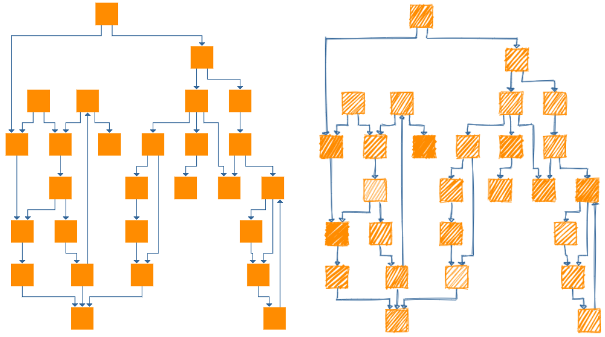
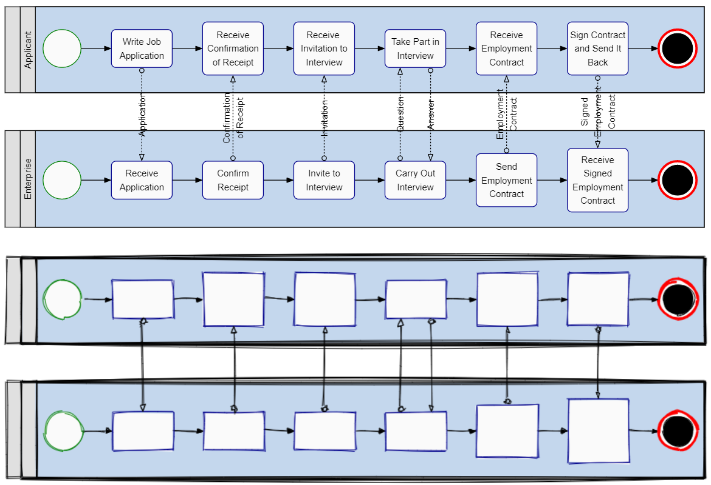
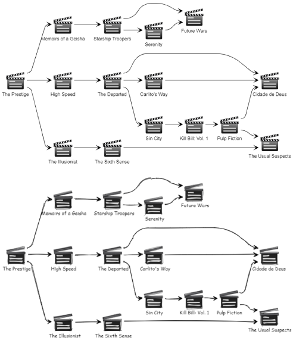
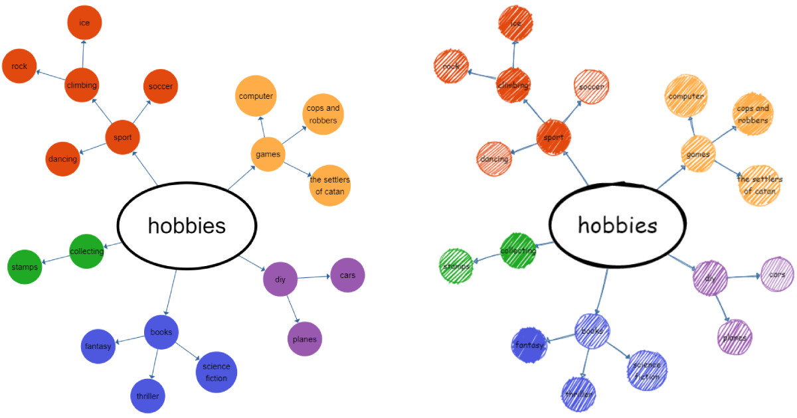

# svg2rough.js

Utilizes [Rough.js](https://github.com/pshihn/rough) to convert an SVG to a hand-drawn visualization.

Note: Labels are currently not supported.

## Usage
It's an ES6 module, so you can run `npm pack` and depend on the tar ball to import `Svg2Roughjs`.

```
  "dependencies": {
    "svg2roughjs": "../svg2roughjs-1.0.0.tgz"
  },
```

For example see `/sample-application/` which is a simple web application with controls to load some sample SVG files and change some of Rough.js parameters.

## Sample Images
These images are taken from the `sample-application` which contains the original input SVG files.





## Credits
* [Rough.js](https://github.com/pshihn/rough) - Draws the hand-drawn elements
* [svg-pathdata](https://github.com/nfroidure/svg-pathdata) - Parses SVGPathElements
* [TinyColor](https://github.com/bgrins/TinyColor) - Help with color manipulation

## License
MIT License (c) Fabian Schwarzkopf